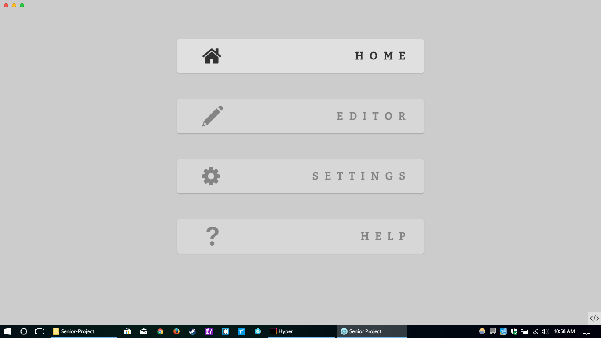
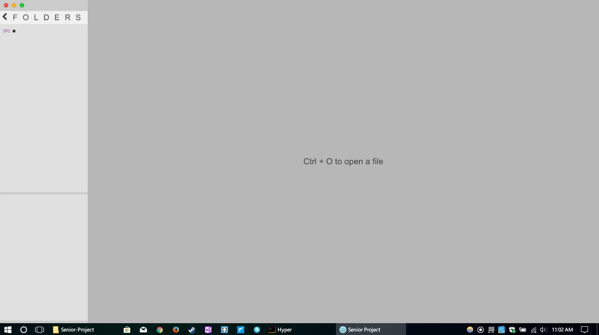

# Senior-Project
This repository is my Senior Project for Highschool at IACS. This is a borderless *code editor* developed with **Web Technologies** (HTML, CSS and Javascript), built to run inside of Electron. It features color customizability, syntax highlighting, and custom font choosing among other things.

## Getting Started
These instructions will get you an up and running copy on your local machine for development and testing purposes. Don't worry, there aren't that many steps.

### Prerequisites
* **npm** must be installed on your machine.
  * **electron**
  * **opn**
  * **jquery**
  * **mime-types**
* A copy of this repository.

### How to use
* Run `npm start` from the root directory of the repository

## Screenshots
Home Page
</img>

Editor Page
</img>
